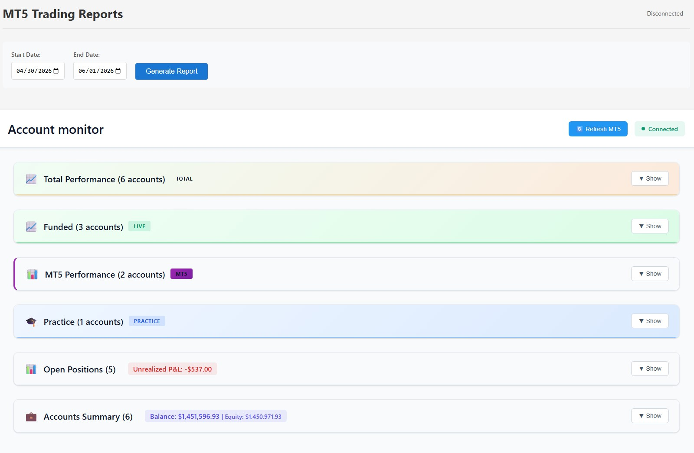

# Trading Dashboard

A full-stack real-time trading monitor supporting **TopStepX** and **MetaTrader 5** accounts simultaneously. Built with a modular Node.js backend and an Angular 19 frontend, deployed on Kubernetes via a hardened CI/CD pipeline.


---



---

## Features

- **Multi-platform** — monitors TopStepX (via SignalR) and MT5 (via MetaAPI) accounts from a single dashboard
- **Real-time** — WebSocket-driven updates with no polling. MT5 receives continuous price tick events via MetaAPI streaming so equity and unrealized P&L update live. TopStepX pushes event-driven updates (position opened/closed, trade executed, balance changed) but does not stream price ticks, so open position P&L only refreshes when an account event fires
- **Stats panels** — daily P&L, win rate, average win/loss, best/worst trade broken down by account group (Live, Practice, Derivatives, MT5, Total)
- **Position tracking** — live unrealized P&L, entry price, duration, stop loss and take profit
- **MT5 reports** — historical deal reports for any date range via the REST API
- **Secure deployment** — non-root Docker image, Kubernetes security contexts, Trivy CVE scanning in CI

---

## Architecture

```
┌─────────────────────────────────────────────────────────────┐
│                        Frontend (Angular 19)                 │
│   Signals · OnPush · SocketService · AccountService         │
└────────────────────────┬────────────────────────────────────┘
                         │  Socket.IO (WebSocket)
┌────────────────────────▼────────────────────────────────────┐
│                     Backend (Node.js)                        │
│                                                              │
│  ┌─────────────────┐        ┌──────────────────────────┐    │
│  │  TopStepX       │        │  MT5 / MetaAPI           │    │
│  │  services/      │        │  services/               │    │
│  │  topstep/       │        │  mt5/                    │    │
│  │  ├─ auth.js     │        │  ├─ client.js            │    │
│  │  ├─ fetcher.js  │        │  ├─ fetcher.js           │    │
│  │  └─ connection  │        │  ├─ streaming.js         │    │
│  │     .js         │        │  └─ mappers.js           │    │
│  └────────┬────────┘        └────────────┬─────────────┘    │
│           │   SignalR              MetaAPI SDK               │
│           ▼                             ▼                    │
│      TopStepX API              MT5 Broker (via MetaAPI)      │
└─────────────────────────────────────────────────────────────┘
```

---

## Tech Stack

| Layer            | Technology                                              |
|------------------|---------------------------------------------------------|
| Frontend         | Angular 19, TypeScript, Socket.IO client                |
| Backend          | Node.js 20, Express, Socket.IO                          |
| TopStepX         | `@microsoft/signalr` (SignalR WebSocket)                |
| MT5              | `metaapi.cloud-sdk` (streaming connection)              |
| Containerisation | Docker (multi-stage, non-root Alpine)                   |
| Orchestration    | Kubernetes on DigitalOcean (DOKS)                       |
| CI/CD            | GitHub Actions, GHCR, Trivy vulnerability scanning      |

---

## Project Structure

```
trading-dashboard/
├── backend/
│   ├── index.js                      # Entry point — wires all modules, graceful shutdown
│   ├── app.js                        # Express + Socket.IO + Helmet + pino-http
│   ├── broadcast.js                  # Emit account/position data to clients
│   ├── config/
│   │   └── accounts.js               # Parses MT5_N_* / TOPSTEP_N_* from env
│   ├── utils/
│   │   ├── date.js                   # Shared UTC date helpers
│   │   └── logger.js                 # Shared pino logger (pretty dev / JSON prod)
│   ├── services/
│   │   ├── topstep/
│   │   │   ├── auth.js               # JWT authentication
│   │   │   ├── fetcher.js            # REST calls (accounts, positions, trades)
│   │   │   └── connection.js         # SignalR setup + real-time event handlers
│   │   └── mt5/
│   │       ├── client.js             # MetaAPI SDK init + account connection
│   │       ├── fetcher.js            # terminalState snapshot read
│   │       ├── streaming.js          # Real-time synchronization listener
│   │       └── mappers.js            # Pure field-mapper functions
│   ├── routes/
│   │   ├── accounts.router.js        # REST endpoints (Zod-validated)
│   │   └── data-builders.js          # Response shape builders
│   ├── socket/
│   │   └── handlers.js               # Socket.IO event handlers
│   ├── __tests__/
│   │   ├── mappers.test.js           # MT5 field mapper unit tests
│   │   ├── date.test.js              # Date utility unit tests
│   │   └── data-builders.test.js     # REST response builder unit tests
│   ├── .env.example                  # All supported environment variables
│   ├── .eslintrc.js                  # ESLint configuration
│   ├── package.json
│   └── package-lock.json
│
├── frontend/
│   └── src/app/
│       ├── models/                   # TypeScript interfaces (Account, Trade…)
│       ├── constants/                # Instrument mappings, trading thresholds
│       ├── services/
│       │   ├── socket.service.ts     # Typed RxJS Observable wrapper
│       │   ├── account.service.ts    # Signal-based state + socket handlers
│       │   └── stats.service.ts      # Pure P&L calculation methods
│       ├── pipes/
│       │   ├── pnl-class.pipe.ts     # CSS class from P&L value
│       │   ├── duration.pipe.ts      # Position open duration
│       │   └── instrument-name.pipe.ts
│       ├── environments/
│       │   ├── environment.ts        # Development config
│       │   └── environment.prod.ts   # Production config
│       ├── app.component.ts          # Root component (OnPush, signals)
│       └── app.component.html
│
├── k8s/
│   ├── deployment.yaml               # Pod spec with security context + probes
│   ├── service.yaml                  # LoadBalancer with sticky sessions
│   ├── configmap.yaml                # Non-sensitive configuration
│   ├── networkpolicy.yaml            # Ingress/egress restrictions
│   ├── serviceaccount.yaml           # Dedicated SA, token automount disabled
│   ├── pdb.yaml                      # PodDisruptionBudget
│   └── secret.template.yaml          # Documents required secret keys
├── Dockerfile                        # Multi-stage, non-root Alpine build
├── .dockerignore
├── .trivyignore                      # Documented CVE suppressions
└── .github/
    ├── dependabot.yml                # Automated dependency updates
    └── workflows/
        └── deploy.yml                # Build → Trivy scan → Deploy pipeline
```

---

## Local Development

### Prerequisites

- Node.js 20+
- Angular CLI (`npm install -g @angular/cli`)
- A [MetaAPI](https://metaapi.cloud) account and token (for MT5 accounts)
- TopStepX account(s) with API access

### Backend

```bash
cd backend
npm install
cp .env.example .env   # then fill in your credentials
npm run dev            # nodemon with auto-reload
```

Server starts on `http://localhost:3010`.

### Frontend

```bash
cd frontend
npm install
npm start
```

App is served at `http://localhost:4210`.

### Running tests

```bash
cd backend
npm test        # Jest — unit tests for mappers, date utils, response builders
npm run lint    # ESLint
```

---

## Backend Design Highlights

### Structured logging (pino)

Every log line is structured JSON in production, ready for ingestion by Grafana Loki, Datadog or any log aggregator. In development, `pino-pretty` renders human-readable output. Child loggers bind the account name to every line so a single query can filter all activity for a specific account:

```json
{ "level": "info", "account": "MT5 Main", "count": 2, "msg": "Positions loaded" }
```

### Graceful shutdown

On `SIGTERM` (sent by Kubernetes before terminating a pod) the server stops accepting new connections, cleanly closes all MetaAPI streaming connections, then exits after a 5-second drain window. Without this, in-flight requests and open WebSocket connections would be hard-killed.

### Security middleware

- **Helmet** sets 11 HTTP security headers (CSP, HSTS, X-Frame-Options, etc.) in a single call
- **`/api/debug`** requires an `X-Debug-Token` header matching `DEBUG_TOKEN` in the environment — unset in production to disable the endpoint entirely
- **Zod** validates the `POST /api/mt5-reports` body with a typed schema rather than manual `if` checks

### MetaAPI streaming architecture

MetaAPI SDK v27 does not support concurrent RPC + streaming connections on the same account. A single streaming connection is used for both real-time event delivery and data access via `connection.terminalState`. Initial data is read from `terminalState` after `waitSynchronized()` resolves; ongoing updates arrive through the synchronization listener.

### Rate limiting

Intentionally omitted. A single-process in-memory rate limiter is misleading at scale — each replica would enforce its own independent counter. The correct implementation requires a shared Redis store, which would also be needed for Socket.IO sticky-session scaling. Both will be added together when horizontal scaling becomes a requirement.

---

## Environment Variables

### Non-sensitive (`k8s/configmap.yaml` in production, `.env` locally)

| Variable | Description | Default |
|---|---|---|
| `PORT` | Backend HTTP port | `3010` |
| `FRONTEND_URL` | CORS allow-list origin | `http://localhost:4210` |
| `LOG_LEVEL` | Pino log level | `info` |
| `DEBUG_TOKEN` | Token required for `GET /api/debug` | unset = disabled |
| `DEFAULT_TOPSTEP_API_URL` | TopStepX REST base URL | `https://api.topstepx.com` |
| `DEFAULT_TOPSTEP_RTC_URL` | TopStepX SignalR base URL | `https://rtc.topstepx.com` |
| `MT5_N_NAME` | Display name for MT5 account N | — |
| `TOPSTEP_N_NAME` | Display name for TopStepX account N | — |

### Sensitive (GitHub Actions secrets → Kubernetes secret in production)

| Variable | Description |
|---|---|
| `METAAPI_TOKEN` | MetaAPI account token |
| `MT5_N_ACCOUNT_ID` | MetaAPI account ID for MT5 account N |
| `TOPSTEP_N_USERNAME` | TopStepX username for account N |
| `TOPSTEP_N_API_KEY` | TopStepX API key for account N |

---

## Adding Accounts

The backend auto-discovers accounts by incrementing `N` until a gap is found. No code changes are ever required — only configuration.

### Adding an MT5 account

**1. Local (`.env`)**

```env
MT5_2_NAME=My Second MT5 Account
MT5_2_ACCOUNT_ID=xxxxxxxx-xxxx-xxxx-xxxx-xxxxxxxxxxxx
```

**2. Production (GitHub Actions secrets + ConfigMap)**

Add `MT5_2_ACCOUNT_ID` to GitHub Actions secrets (Settings → Secrets → Actions), then:

```yaml
# k8s/configmap.yaml
MT5_2_NAME: "My Second MT5 Account"
```

```yaml
# .github/workflows/deploy.yml — uncomment the Account 2 env and --from-literal lines
env:
  MT5_2_ACCOUNT_ID: ${{ secrets.MT5_2_ACCOUNT_ID }}
run: |
  kubectl create secret generic trading-dashboard-credentials \
    ...
    --from-literal=MT5_2_ACCOUNT_ID="$MT5_2_ACCOUNT_ID"
```

---

### Adding a TopStepX account

TopStepX accounts support an optional sub-account filter. When `TOPSTEP_N_SUB_M` entries are present, only sub-accounts whose name contains the given string are monitored. Omit them entirely to monitor all sub-accounts under that login.

**1. Local (`.env`)**

```env
TOPSTEP_2_NAME=TopStep Secondary
TOPSTEP_2_USERNAME=my_username
TOPSTEP_2_API_KEY=my_api_key

# Optional: restrict to specific sub-accounts by name fragment
TOPSTEP_2_SUB_1=Eval
TOPSTEP_2_SUB_2=Express
```

**2. Production (GitHub Actions secrets + ConfigMap)**

Add `TOPSTEP_2_USERNAME` and `TOPSTEP_2_API_KEY` to GitHub Actions secrets, then:

```yaml
# k8s/configmap.yaml
TOPSTEP_2_NAME: "TopStep Secondary"
```

```yaml
# .github/workflows/deploy.yml — uncomment the Account 2 blocks
env:
  TOPSTEP_2_USERNAME: ${{ secrets.TOPSTEP_2_USERNAME }}
  TOPSTEP_2_API_KEY:  ${{ secrets.TOPSTEP_2_API_KEY }}
run: |
  kubectl create secret generic trading-dashboard-credentials \
    ...
    --from-literal=TOPSTEP_2_USERNAME="$TOPSTEP_2_USERNAME" \
    --from-literal=TOPSTEP_2_API_KEY="$TOPSTEP_2_API_KEY"
```

> Sub-account filters (`TOPSTEP_N_SUB_M`) are non-sensitive and go in the ConfigMap, not the secret.

---

### Full example: three accounts of each type

```env
# MT5
METAAPI_TOKEN=your_token

MT5_1_NAME=MT5 Main
MT5_1_ACCOUNT_ID=xxxxxxxx-xxxx-xxxx-xxxx-xxxxxxxxxxxx

MT5_2_NAME=MT5 Secondary
MT5_2_ACCOUNT_ID=yyyyyyyy-yyyy-yyyy-yyyy-yyyyyyyyyyyy

MT5_3_NAME=MT5 Crypto
MT5_3_ACCOUNT_ID=zzzzzzzz-zzzz-zzzz-zzzz-zzzzzzzzzzzz

# TopStepX
TOPSTEP_1_NAME=TopStep Main
TOPSTEP_1_USERNAME=username1
TOPSTEP_1_API_KEY=key1
TOPSTEP_1_SUB_1=50K

TOPSTEP_2_NAME=TopStep Eval
TOPSTEP_2_USERNAME=username2
TOPSTEP_2_API_KEY=key2

TOPSTEP_3_NAME=TopStep Express
TOPSTEP_3_USERNAME=username3
TOPSTEP_3_API_KEY=key3
TOPSTEP_3_SUB_1=Express
TOPSTEP_3_SUB_2=Eval
```

---

## API Reference

| Method | Endpoint | Description |
|--------|----------|-------------|
| `GET` | `/api/health` | Liveness/readiness probe — returns uptime and connected account counts |
| `GET` | `/api/accounts` | All accounts with summary info |
| `GET` | `/api/all-data` | Full account data including trades and positions |
| `GET` | `/api/accounts/summary` | Aggregated totals by platform |
| `GET` | `/api/positions/summary` | All open positions across all accounts |
| `GET` | `/api/mt5/:accountId/info` | Full info for a single MT5 account |
| `GET` | `/api/mt5/:accountId/positions` | Open positions for an MT5 account |
| `GET` | `/api/mt5/:accountId/deals` | Today's deals for an MT5 account |
| `GET` | `/api/debug` | Connection state — requires `X-Debug-Token` header |
| `POST` | `/api/mt5-reports` | Historical deal report (`{ startDate, endDate }`) |

---

## WebSocket Events

### Server → Client

| Event | Payload | Description |
|-------|---------|-------------|
| `initialData` | `Account[]` | Full snapshot on connect |
| `accountListUpdate` | `Account[]` | Full account list refresh |
| `positionsSummary` | `PositionSummary[]` | All open positions |
| `accountUpdate` | TopStepX account delta | Balance / name change |
| `tradeUpdate` | TopStepX trade | New or updated trade |
| `positionUpdate` | TopStepX position | Position opened/changed/closed |
| `mt5AccountUpdate` | MT5 account info | Equity, margin, P&L update |
| `mt5PositionUpdate` | MT5 position | Position opened or updated |
| `mt5PositionClosed` | `{ positionId }` | Position closed |
| `mt5OrderUpdate` | MT5 order | Pending order update |
| `mt5OrderCompleted` | `{ orderId }` | Order filled or cancelled |
| `mt5DealUpdate` | MT5 deal | New closed deal |

### Client → Server

| Event | Description |
|-------|-------------|
| `refreshMT5` | Trigger manual MT5 data refresh |

---

## Deployment

The project ships with a complete Kubernetes setup targeting DigitalOcean Kubernetes (DOKS).

### CI/CD Pipeline (GitHub Actions)

Every push to `main`:

1. **Build** — Docker multi-stage build (Alpine, non-root user, pinned Node version)
2. **Push** — image tagged with short SHA to GitHub Container Registry
3. **Scan** — Trivy scans for HIGH/CRITICAL CVEs; pipeline fails if any unfixed vulnerabilities are found. Known unfixable transitive CVEs from `metaapi.cloud-sdk` are documented in `.trivyignore` with justifications
4. **Deploy** — `kubectl` rolling update with zero-downtime (`maxUnavailable: 0`)
5. **Verify** — waits for all pods to pass readiness probes before reporting success

### Required GitHub Actions Secrets

| Secret | Description |
|--------|-------------|
| `DO_TOKEN_DEPLOY_APPS` | DigitalOcean API token |
| `DO_CLUSTER_NAME` | DOKS cluster name |
| `METAAPI_TOKEN` | MetaAPI token |
| `MT5_1_ACCOUNT_ID` | MT5 account ID |
| `TOPSTEP_1_USERNAME` | TopStepX username |
| `TOPSTEP_1_API_KEY` | TopStepX API key |

### Kubernetes Security Highlights

- Non-root container user (UID/GID 1001) with `/app/.metaapi` pre-created
- `allowPrivilegeEscalation: false`
- All Linux capabilities dropped
- Dedicated `ServiceAccount` with token automount disabled
- `NetworkPolicy` restricting ingress to port 3010 and egress to DNS + HTTPS only
- `PodDisruptionBudget` allowing controlled disruption during cluster maintenance
- Resource requests and limits on every container
- Startup, liveness and readiness probes (extended startup window for MetaAPI sync)
- `sessionAffinity: ClientIP` on the Service for Socket.IO WebSocket stability
- Secrets injected at deploy time via GitHub Actions, never stored on disk or in version control
- Dependabot configured for automated dependency updates across backend, frontend and GitHub Actions

### Manual deploy (first time)

```bash
# Authenticate
doctl kubernetes cluster kubeconfig save <your-cluster-name>

# Create namespace
kubectl create namespace apps

# Apply non-sensitive config
kubectl apply -f k8s/configmap.yaml -n apps

# Create credentials secret
kubectl create secret generic trading-dashboard-credentials \
  --namespace apps \
  --from-literal=METAAPI_TOKEN=<token> \
  --from-literal=MT5_1_ACCOUNT_ID=<id> \
  --from-literal=TOPSTEP_1_USERNAME=<username> \
  --from-literal=TOPSTEP_1_API_KEY=<key>

# Apply manifests
kubectl apply -f k8s/serviceaccount.yaml -n apps
kubectl apply -f k8s/deployment.yaml     -n apps
kubectl apply -f k8s/service.yaml        -n apps
kubectl apply -f k8s/networkpolicy.yaml  -n apps
kubectl apply -f k8s/pdb.yaml            -n apps
```

---

## Troubleshooting

**Backend won't start** — verify all required env variables are set and port 3010 is free. Check for `pino-pretty` not found errors — ensure `NODE_ENV=production` is set in the container environment.

**No MT5 data** — MetaAPI's initial synchronization can take up to 2 minutes on cold start. Check backend logs for `Streaming connection established` before assuming a failure. If you see `Timed out waiting for MetaApi to synchronize`, check that no global npm overrides are forcing incompatible versions of `socket.io-parser` or `tar` into MetaAPI's dependency tree.

**No TopStepX data** — confirm your API key is valid and the account has API access enabled. Check logs for `Authentication successful`. If initial data loads but real-time updates stop, verify the SignalR connection is still active in the logs.

**TopStepX unrealized P&L not updating** — this is expected. TopStepX's SignalR feed is event-driven rather than tick-driven; open position values only refresh when the account receives an event (trade closed, balance change, etc.).

**Frontend won't connect** — ensure the backend is running and `FRONTEND_URL` in the ConfigMap matches the origin the Angular app is served from. Check `src/environments/environment.prod.ts` has the correct backend URL for production builds.

**MT5 connection error `ERR_INVALID_CHAR`** — a Kubernetes secret value has a trailing newline. Delete and recreate the secret ensuring no whitespace is included in the values, then redeploy. All env var reads in `config/accounts.js` call `.trim()` to guard against this.

**Trivy scan fails in CI** — check `.trivyignore` for documented suppressions. For new fixable vulnerabilities, update the affected package in `dependencies` or add an `overrides` entry in `package.json`, then commit the regenerated lockfile.

---

## License

ISC